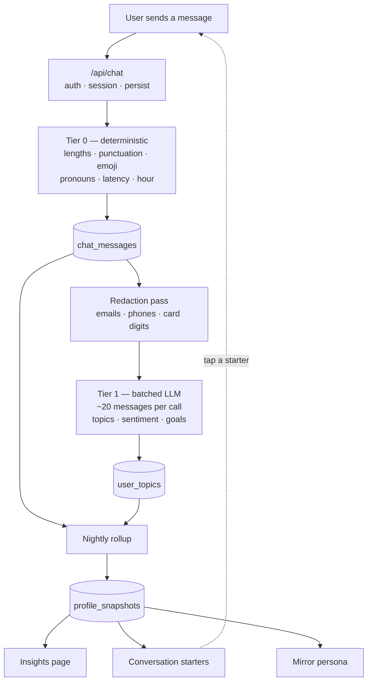
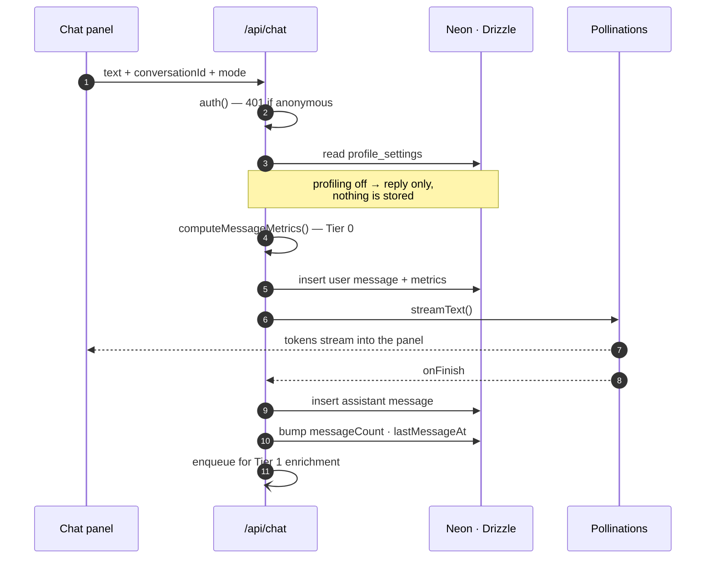
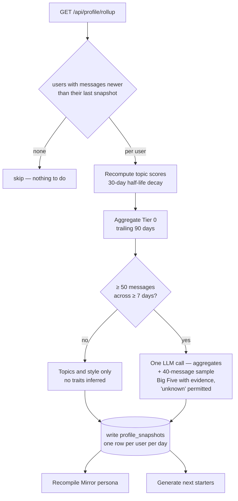
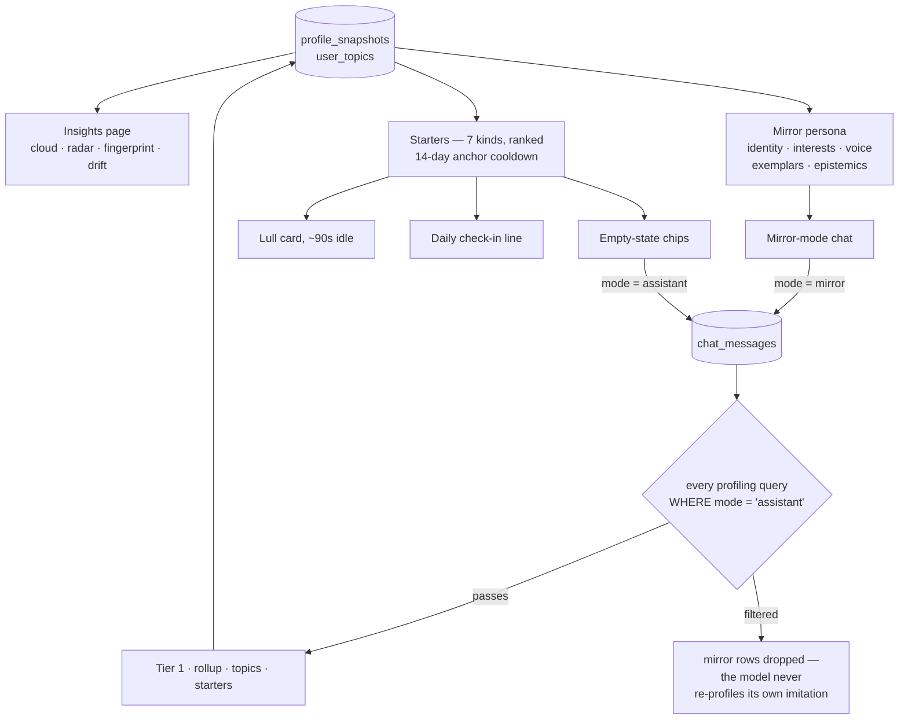

# Chat Personality Profiling & Mirror Mode Design

**Date:** 2026-07-27
**Status:** Draft — for review

## Problem

The app has a chat assistant (`src/features/chat`, `/api/chat`) that is completely
stateless. Messages live in React state via `useChat` and are gone on reload. Every
conversation the user has is thrown away.

Those conversations are the richest first-party signal in the product — richer than
`interests`, `articles`, or `purchases` — and we currently capture none of it.

We want to:

1. Persist conversations and derive a **profile** of the user from them — topics they
   care about, how they communicate, and (with confidence bounds) personality traits.
2. Use that profile to **organically start conversations** — suggested openers that feel
   like a friend picking up a thread, not a chatbot prompt list.
3. Give the user a **page to see themselves** — word cloud of topics, personality radar,
   communication fingerprint, drift over time.
4. Let the user turn on **Mirror Mode** — chat with a persona inferred from their own
   profile.

## Non-goals

- Clinical or diagnostic personality assessment. Everything here is a soft inference
  shown with confidence, editable by the user.
- Profiling other users, org-wide profiling, or sharing profiles between accounts.
- Real-time (per-keystroke) inference. Rollups are daily.

---

## Current State

| Piece | Where | State |
|-------|-------|-------|
| Chat UI | `src/features/chat/components/chat-panel.tsx` | `useChat` + `DefaultChatTransport`, in-memory only |
| Chat API | `src/app/api/chat/route.ts` | `streamText` via Pollinations (`openai` model), fixed system prompt, no persistence |
| Panel state | `src/features/chat/store.ts` + `context.tsx` | Zustand `open/toggle/close` |
| Explicit interests | `interests` table | Manually managed, used by article generation |
| Daily job pattern | `src/app/api/articles/generate/route.ts` | GET cron route → server actions, `Promise.allSettled` per user |
| Daily nudge pattern | `notifications/actions/daily-summary.ts` | Idempotent per `(userId, date)`, one row per user per day |
| Charts | `recharts` ^2.15 | `RadarChart`, `AreaChart` already in use on dashboard |

The daily-summary and cron-route patterns are the right precedent for the rollup job —
this design reuses them rather than introducing a queue.

---

## Architecture

Four layers, each independently shippable:

```
 capture ──▶ signals ──▶ profile ──▶ surfaces
 (write)     (tier 0/1)   (rollup)    (starters / insights page / mirror)
```

### Layer 1 — Capture

`/api/chat` becomes stateful. On each request it:

1. Resolves `userId` from Clerk (`auth()`), rejects anonymous.
2. Upserts a `chat_conversations` row (new when `conversationId` absent, or when the last
   message is older than a 6-hour idle gap → new session).
3. Inserts the incoming user message **before** streaming.
4. Uses `onFinish` from `streamText` to insert the assistant message with token counts.
5. Fire-and-forget enqueues the user message for Tier 1 enrichment (see below).

Messages carry `mode` (`'assistant' | 'mirror'`). **Mirror-mode transcripts are never fed
back into profiling** — see Risks.

### Layer 2 — Signals

Two tiers, cheap before expensive.

**Tier 0 — deterministic, synchronous, no LLM.** Computed in a pure function
(`features/chat-profile/utils/metrics.ts`) at insert time and stored on the message row.
No network, no cost, no third-party exposure. Covers most of the stylometric signal:
lengths, punctuation fingerprint, emoji, pronoun ratios, hedges, question ratio,
capitalization style, typo/correction markers, response latency, local hour-of-day.

**Tier 1 — LLM tagging, async, batched.** A worker drains messages where
`enriched_at IS NULL`, batches ~20 at a time, and asks for structured JSON (same
Pollinations OpenAI-compatible endpoint the rest of the app uses, `response_format:
json_object`, validated with a Zod schema). Returns per message: topics (slug + label +
category), entities, intent, sentiment valence/arousal, emotion label, formality,
concreteness, stated goals/preferences. Batching keeps this at roughly one call per
20 messages instead of one per message.

Before any text leaves the server for Tier 1, it passes a **redaction pass** — regex strip
of emails, phone numbers, long digit runs (cards/accounts), and street-address-shaped
strings. Tier 1 sees redacted text; the raw row is untouched.

### Layer 3 — Profile rollup

A nightly cron (`/api/profile/rollup`, following the `/api/articles/generate` shape)
processes only users with new messages since their last snapshot:

1. **Topic weights.** For each topic, `score = Σ exp(-ln2 · daysAgo / 30)` — a 30-day
   half-life so the cloud reflects who you are *now*, not who you were in January.
   Upserted into `user_topics` with `mention_count`, `first_seen_at`, `last_seen_at`,
   rolling sentiment.
2. **Style fingerprint.** Aggregate Tier 0 columns into means/variances over the trailing
   90 days.
3. **Trait inference.** One LLM call per user with the aggregated stats + a stratified
   sample of ~40 messages (recent + representative), asking for Big Five scores *with
   per-trait evidence and confidence*. The prompt requires the model to return
   `"unknown"` for any trait it cannot support with evidence.
4. **Snapshot.** Write an immutable `profile_snapshots` row. History is the point —
   snapshots are what make the drift timeline possible.
5. **Persona compile.** Regenerate the Mirror Mode system prompt from the fresh snapshot.
6. **Starters.** Generate the next batch of conversation starters.

**Confidence gating.** Nothing personality-shaped is shown until ≥ 50 analyzed user
messages across ≥ 7 distinct days. Below that the insights page shows topics only, with a
"profile strength" meter explaining what's still needed. This matters: a Big Five radar
drawn from nine messages is a horoscope.

### Layer 4 — Surfaces

Three consumers, covered in their own sections below: conversation starters, the insights
page, and Mirror Mode.

---

## Flow Diagrams

### Figure 1 — End to end



Tier 0 runs in-request as a pure function — no network, no cost, no text leaving the
server. Tier 1 is the only per-message cost, batched ~20:1 and running after the reply has
already streamed so it stays out of the user's latency path. Redaction sits before Tier 1
rather than before storage: the stored row keeps raw text, only the copy sent for tagging
is stripped.

### Figure 2 — One request



The user message is written before the model is called, so an abandoned or failed stream
still leaves a complete record. Consent is checked per request rather than assumed at
signup — with profiling off the route behaves exactly as it does today.

### Figure 3 — Nightly rollup



The gate is the load-bearing box. Snapshots are immutable and dated, which is what makes
the drift timeline possible. Only users with new messages are processed, keeping nightly
cost proportional to activity rather than to signups.

### Figure 4 — Surfaces and the exclusion guard



Without the guard the feature eats itself: mirror output is a model's imitation of the
user, and profiling it makes the next persona an imitation of an imitation, drifting
further each night with nothing in the UI to show it happened.

---

## Data Model

New tables in `src/db/schema.ts`. All follow existing repo conventions: `uuid` PKs,
`text('user_id')` (Clerk IDs, not FK), `text` booleans (`'true' | 'false'`), JSON stored as
`text`.

```ts
chat_conversations
  id, userId, title (nullable, LLM-named after 4 turns), mode,
  messageCount, startedAt, lastMessageAt

chat_messages
  id, conversationId, userId, role, content,
  mode,                       // 'assistant' | 'mirror' — mirror excluded from profiling
  // Tier 0, written at insert
  charCount, wordCount, sentenceCount, questionCount, exclamationCount,
  emojiCount, uppercaseRatio, hedgeCount, firstPersonRatio, secondPersonRatio,
  collectiveRatio, avgWordLength, typeTokenRatio, capStyle,
  responseLatencyMs,          // null for assistant rows
  localHour, localDow,
  // Tier 1
  enrichedAt (nullable), signals (text/JSON),
  createdAt

user_topics
  id, userId, slug (unique per user), label, category,
  score,                      // recency-decayed, recomputed nightly
  mentionCount, sentimentAvg,
  status,                     // 'active' | 'muted' | 'pinned'  (user-editable)
  firstSeenAt, lastSeenAt

profile_snapshots
  id, userId, date,           // unique (userId, date)
  traits (JSON),              // { openness: { score, confidence, evidence[] }, ... }
  style (JSON),               // aggregated Tier 0 fingerprint
  topTopics (JSON),           // denormalized for cheap page render
  values (JSON), archetype,
  sourceMessageCount, daysObserved, modelVersion, createdAt

conversation_starters
  id, userId, text, kind, anchorTopicSlug (nullable), rationale,
  status,                     // 'pending' | 'shown' | 'accepted' | 'dismissed' | 'expired'
  scheduledFor, shownAt, respondedAt, createdAt

persona_configs
  id, userId, systemPrompt, styleParams (JSON), exemplars (JSON),
  snapshotId, enabled, version, lastBuiltAt

profile_settings
  userId (PK), profilingEnabled, mirrorEnabled,
  retentionDays, excludedCategories (JSON), updatedAt
```

Indexes: `(userId, createdAt)` on messages, `(conversationId, createdAt)` on messages,
partial index on `enriched_at IS NULL` for the Tier 1 drain, `(userId, score DESC)` on
topics, unique `(userId, date)` on snapshots.

---

## Conversation Starters

The goal is a suggestion that reads like a friend remembering something, not a menu item.
That comes from anchoring each starter to a specific stored fact.

### Kinds

| Kind | Anchor | Example shape |
|------|--------|---------------|
| `follow_up` | An open thread — stated intent with no later resolution | "Did you end up trying that ramen place?" |
| `deep_dive` | High-score topic discussed only shallowly | "You keep coming back to X — what got you into it?" |
| `revival` | Topic with high lifetime count, `lastSeenAt` > 30d | "Haven't heard about X in a while." |
| `adjacency` | Neighbour of a top topic, not yet in the profile | Broadens coverage |
| `gap_probe` | Trait dimension with lowest confidence | Active learning — designed to elicit signal |
| `temporal` | Time-of-day matching the user's histogram for that topic | Sunday-morning topics on Sunday morning |
| `cross_feature` | Signal from `purchases`/`workouts`/`articles` | "Third week running on that split — how's it feeling?" |

### Ranking and fatigue

```
score = relevance × recencyFit × novelty × gapValue − fatiguePenalty
```

- Never show the same anchor twice within 14 days.
- Cap 3 pending at a time, max 1 auto-surfaced per session.
- A dismissal decays that `kind`'s weight for the user; three dismissals of the same kind
  suppress it for 30 days. Acceptance rate per kind is itself a profile signal
  (`interaction` parameters below).

### Surfaces

1. **Empty state chips** in `chat-panel.tsx` — replaces the current static "Ask me
   anything" copy with 2–3 tappable starters.
2. **Lull card** — after ~90s of idle with the panel open, a dismissible ghost card
   appears above the input. Same visual treatment as the ghost repurchase cards already
   shipped on `/purchases` (commit `474c42d`), so it reads as a familiar affordance.
3. **Daily summary** — one starter appended to the existing `☀️ Today's Check-in` row, so
   it rides the notification path that already exists rather than adding a new one.

Tapping a starter marks it `accepted`, sends it as the user's first message, and tags the
conversation with `starterId` for attribution.

---

## Insights Page (`/profile/insights`)

New route + nav entry under the existing **AI** group (`icon: 'sparkles'`), so it sits with
Feed / Games / Fortune.

**Sections, top to bottom:**

1. **Profile strength** — the metric row. Detailed below; it is the page's disclosure
   surface, and below the gate it is the whole page apart from topics.
2. **Topic cloud** — the headline visual. Font size scales with decayed `score`, colour by
   category. Click a topic → side panel: first mentioned, sentiment trend sparkline,
   related topics, 3 sample messages ("why we think this"), and pin / mute controls.
3. **Personality radar** — Big Five via recharts `RadarChart`, each axis rendered with its
   confidence as opacity, plus a plain-language sentence per trait and the evidence that
   produced it. Every trait has a "this isn't me" button that writes a correction and
   down-weights that inference in the next rollup.
4. **Communication fingerprint** — avg message length, emoji rate, question ratio,
   formality, median response latency, and an hour × weekday activity heatmap.
5. **Drift** — trait and topic movement across snapshots, so the page has something to say
   over time rather than being a one-shot reveal.
6. **Mirror Mode card** — status, message count backing the persona, enable/disable, and
   "Talk to your mirror".
7. **Data controls** — pause profiling, retention window, delete raw messages while keeping
   aggregates, delete everything, export JSON.

### Profile strength — the metric row

This row is the feature's disclosure surface. Its job is to answer "what do you know about
me, and how sure are you?" before the user scrolls into anything inferred. It should read
as honestly when it is empty as when it is full, so it is specified at three states:
profiling off (the default), below the evidence gate, and established.

Card idiom follows the existing dashboard grid in `src/app/dashboard/overview/layout.tsx` —
`Card` → `CardHeader` with `CardDescription` label and a right-aligned icon → `CardTitle`
as a large `tabular-nums` figure → `CardAction` badge → muted `CardFooter` context line.

**Primary row — four cards:**

| Card | Source | Footer line | At zero |
|------|--------|-------------|---------|
| Messages analyzed | `count(chat_messages)` where `role='user'`, `mode='assistant'`, `enriched_at not null` | "of N captured" — exposes enrichment lag rather than hiding it | 0, "starts once you chat" |
| Days observed | `count(distinct date(created_at))` | "since {firstSeen}" | 0 of 7 — gate progress |
| Topics tracked | `count(user_topics)` where `status='active'` | "N new this week · N dormant" | seeded from the existing `interests` table |
| Profile confidence | derived, see below | band label; the percentage is secondary | "—", "not enough evidence yet" |

**Strength strip** — beneath the cards, four segments (Topics, Style fingerprint,
Personality traits, Mirror Mode) showing what is unlocked, what is next, and one plain
sentence naming exactly what would unlock it: *"27 more messages across 3 more days
unlocks personality traits."*

**System state row — three smaller cards:** last rollup and next run; traits inferred
("4 of 5 — agreeableness still unknown", naming the gap explicitly); mirror readiness with
the message count backing the persona.

**Confidence formula:**

```
volume    = min(1, analyzedMessages / 200)
breadth   = min(1, daysObserved / 30)
coverage  = traitsWithEvidence / 5
stability = 1 - meanAbsDelta(traits, last 3 snapshots)

confidence = 0.35·volume + 0.25·breadth + 0.20·coverage + 0.20·stability
```

Displayed as a band — Building / Fair / Strong — with the percentage secondary. A bare
percentage invites reading it as accuracy, which it is not: it measures how much evidence
the profile rests on, not how right it is.

`stability` is the term that earns its place. Volume and breadth only report that the
system saw a lot. Stability reports that the conclusions stopped moving between nightly
snapshots — the only one of the four that degrades when the profile is wrong and thrashing.

### Word cloud implementation

No cloud library is in `package.json`. Recommendation: **hand-roll a flex-wrap tag cloud**
— topics sorted by score, `font-size` interpolated across a clamped range, wrapped in a
responsive container. It is ~40 lines, has zero new dependencies, is theme-aware and
accessible (real focusable elements, not canvas text), and reads fine on mobile. A true
spiral-packed cloud (`d3-cloud`) looks better on desktop but needs canvas measurement, a
new dep, and has no accessible fallback. Start with the tag cloud; revisit if the visual
doesn't land.

---

## Mirror Mode

### Persona compilation

From the latest snapshot, build a system prompt with five blocks:

1. **Identity** — one-paragraph summary of who this person appears to be.
2. **Interests** — top ~12 topics with stance and depth ("talks about X constantly, with
   expert vocabulary; mentions Y occasionally and negatively").
3. **Voice** — concrete, mechanical style rules derived from Tier 0: target sentence
   length, emoji policy and favourites, punctuation habits, capitalization style,
   contractions, characteristic phrases.
4. **Exemplars** — 5–10 verbatim user messages as few-shot style anchors, chosen for
   representativeness (near the centroid of the user's style vector) plus recency.
5. **Epistemics** — the honesty clause: stay in voice, but when asked about something the
   profile doesn't cover, say you're not sure rather than inventing biography. This is what
   keeps the mirror from confabulating a life story.

### Runtime

`/api/chat` accepts `mode: 'mirror'`. Mirror requests swap the system prompt for the
compiled persona and raise temperature. The UI badges the panel unmistakably — header
changes to "Mirror · inferred from 412 messages", different accent colour, and a persistent
"this is a model of you, not you" note in the empty state.

### Guardrails

- **Opt-in only**, off by default, disable + delete persona in one tap.
- **Mirror transcripts are excluded from profiling.** Without this the model eventually
  trains on its own imitation and the profile collapses into a caricature of itself.
- Mirror output is not shareable and not exportable as another person's voice.
- The persona is regenerated from snapshots only — never hand-edited into something the
  data doesn't support.

---

## Profiling Parameters

The catalogue below is what *can* be extracted from chat messages. Tier 0 items are free
and deterministic; Tier 1 needs an LLM; Derived items come from the rollup.

### A. Lexical / surface (Tier 0)

Message length (chars, words); sentence count; average word length; vocabulary richness
(type–token ratio); rare-word rate; reading grade level; **function-word distribution**
(articles, prepositions, conjunctions — the classic stylometric fingerprint, more
identifying than content words); pronoun ratios (I/me/my = self-focus, we/us = collective
orientation, you = other-focus); contraction rate; slang and domain jargon density; filler
words; hedges ("maybe", "kind of", "I think" — tentativeness); intensifiers ("really",
"so", "literally"); profanity rate; code-switching / multilingual mixing; signature n-grams
and catchphrases; typo rate and self-correction behaviour ("\*meant"); capitalization style
(all-lowercase / sentence case / SHOUTING); punctuation fingerprint (ellipses,
multi-exclamation, em-dashes, Oxford comma, double space after period); emoji rate,
favourite emoji, emoticon vs emoji preference.

### B. Syntactic / structural (Tier 0)

Question vs statement vs imperative ratio; sentence complexity and subordinate clause
depth; list-making vs prose; markdown usage (bullets, code blocks, bold); message
fragmentation (one considered paragraph vs five rapid fragments); opener and closer habits
("hey", "thanks!", no greeting at all).

### C. Semantic / content (Tier 1)

Topics and subtopics (hierarchical taxonomy plus free tags); named entities (people,
places, orgs, products, media titles); life domains (work, health, finance, relationships,
hobbies, learning, travel, food); **stated goals and intentions** ("I want to…", "I'm
planning…" — the main source of `follow_up` starters); problems and pain points; questions
asked → a curiosity map distinct from the topic map; explicit preferences and aversions
with polarity; values signals (Schwartz dimensions: achievement, security, autonomy,
benevolence, tradition, stimulation); opinions and their strength; knowledge depth per
topic (novice vs expert vocabulary within the same subject); recurring people and their
relationship roles (a social graph of mentions); temporal orientation (past / present /
future focus); concreteness vs abstraction.

### D. Affective (Tier 1)

Sentiment valence and arousal per message; discrete emotion labels (joy, anger, fear,
sadness, surprise, anticipation); **emotional volatility** (variance within a session — a
stronger trait signal than mean sentiment); stress and overwhelm markers; self-deprecation
rate; gratitude expressions; humour and sarcasm rate and style; politeness and
face-saving markers; optimism vs pessimism measured on future-tense statements specifically.

### E. Interactional / behavioural (Tier 0 + derived)

Response latency distribution (median and tail); session length and messages per session;
turns per topic before switching; **time-of-day and day-of-week histogram** (chronotype);
initiation rate (self-started vs starter-accepted); topic switch rate (focused vs
scattered); follow-up depth before abandoning a thread; pushback and correction rate toward
the assistant (assertiveness / agreeableness signal); suggestion acceptance rate broken
down by starter kind; retry and rephrase behaviour; copy-action frequency on assistant
replies; burst patterns (steady daily vs weekend binges).

### F. Psychometric inferences (Derived — always with confidence)

- **Big Five** — openness (topic diversity, abstraction, novelty seeking);
  conscientiousness (planning language, punctuation care, stated-goal follow-through);
  extraversion (volume, social mentions, exclamation rate); agreeableness (politeness,
  hedging, agreement rate); neuroticism (negative affect, volatility, first-person
  pronoun density).
- Communication archetype (analytical / driver / amiable / expressive).
- Decision style (intuitive vs deliberative), risk tolerance.
- Learning style (asks for examples vs theory vs first principles).
- Humour style; motivation drivers (mastery, recognition, autonomy, connection).
- MBTI-style typing — **only if framed as playful**. It tests poorly for reliability and
  should never sit next to Big Five as though it were equivalent.

### G. Meta / quality (Derived)

Evidence count per dimension; days observed; cross-day consistency (variance); recency-
weighted vs lifetime scores; drift detection (trait moved > threshold vs last month);
explicit confidence intervals and a real "unknown" state; per-claim provenance (which
message IDs produced it) so the page can always answer "why do you think that?"; and
correction history from the user's "this isn't me" taps.

### H. Cross-feature signals already in this app (Phase 5)

The app already holds a lot of non-chat signal worth fusing in: `interests` (explicit,
best cold-start seed); `articles` read and generated, plus their topics; `lists` and
`list_items` (URLs and platforms → media taste); `purchases` (categories and cadence →
routine and domestic priorities); `workouts` and `workout_sessions` (consistency → a
behavioural conscientiousness proxy that doesn't depend on self-report); `payments`
(financial routine); `daily_plays` (streak persistence); `ai_characters` (fictional taste
and imagination).

### I. Explicit red lines — never inferred or stored

No inference of health conditions, sexual orientation, religion, political affiliation,
ethnicity, immigration status, or precise location. These are GDPR Article 9 special
categories; a wrong inference is harmful and a correct one is a liability. The Tier 1
prompt names these as prohibited output fields, and the redaction pass strips emails,
phone numbers, long digit sequences, and address-shaped strings before any text is sent
for enrichment. If a user wants a sensitive category tracked, it comes from an explicit
per-category opt-in, never from inference.

---

## Privacy & Consent

- Profiling is **off by default**. A one-time consent card in the chat panel explains what
  gets stored and derived before anything is written beyond raw messages.
- Raw message retention and derived-signal retention are separate settings — a user can
  purge transcripts while keeping their profile, or the reverse.
- Per-topic mute and "forget this conversation" both take effect in the next rollup and
  retroactively remove the topic's contribution.
- Chat text already reaches Pollinations for the reply itself; Tier 1 increases exposure,
  so it sends redacted text only.
- Everything is server-side and scoped by Clerk `userId` in every query. As `docs/nav-rbac.md`
  notes, nav filtering is UX-only — these routes and actions must enforce ownership
  themselves.

---

## Risks

| Risk | Mitigation |
|------|-----------|
| **Profile echo chamber** — mirror output re-profiled as the user | `mode` column; mirror rows excluded from every profiling query |
| **Barnum effect / wrong traits** | Confidence gating, visible evidence, per-trait correction, plain-language framing |
| **Cold start** | Topics-only view below the gate; seed from `interests` |
| **Cost** | Tier 0 free; Tier 1 batched 20:1; rollup only for users with new messages |
| **Uncanny valley in mirror mode** | Explicit badging, epistemic honesty clause, one-tap exit |
| **Creepiness** | Nothing is inferred silently — the insights page is the disclosure surface, shipped before Mirror Mode |
| **Topic taxonomy drift** | Slug normalization + nightly merge of near-duplicate slugs |

---

## Phasing

| Phase | Ships | Value on its own |
|-------|-------|------------------|
| 0 | Persistence + consent + conversation history | Chat survives reload — worth it independently |
| 1 | Tier 0 metrics, Tier 1 topics, insights page with cloud + fingerprint | The word cloud, which is the visible hook |
| 2 | Daily rollup, snapshots, personality radar, drift | The personality layer |
| 3 | Conversation starters across all three surfaces | The organic-engagement loop |
| 4 | Mirror Mode | The payoff feature |
| 5 | Cross-feature signal fusion | Profile depth beyond chat |

Each phase is independently shippable and useful. Phase 0 alone fixes a real gap.

## Open Questions

1. Word cloud — hand-rolled tag cloud (recommended) or add `d3-cloud` for true packing?
2. Does the rollup cron piggyback on `/api/articles/generate` or get its own route? A
   separate route is cleaner but means a second schedule to configure.
3. Embeddings for exemplar retrieval in Mirror Mode — worth a `pgvector` column, or is
   recency-plus-centroid selection good enough for v1? (Recommend: good enough for v1.)
4. Should Mirror Mode conversations be retained at all, or ephemeral by default?
